# Fruits-and-Vegetable-Recognition-System-using-CNN
<h2>Description:</h2> It is a fruits and vegetable recognition system using CNN and provide the recipe suggestions to the user. User can click vegetable or fruit image using this app. This CNN model predicts the provided image and gives the available recipe suggestions as well as the procedures. 
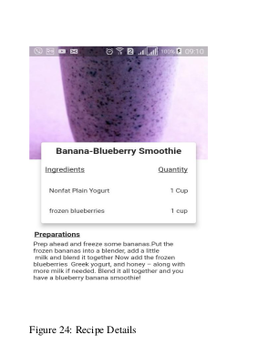

<strong>Abstract</strong> 
This project entitled “Fruits and Vegetable Recognition system with Recipe using CNN” is an
Artificial Intelligence based image recognition system which uses the images of the fruits
and vegetables taken by the user‟s mobile device (camera) to recognize it and provide recipe.
The ultimate goal of this research is to develop computer-aided technical solutions to enhance
and improve the accuracy of recognizing fruits and vegetables. Proposed system in this
paper aims to improve the accuracy of identification of fruit(s) and vegetable(s) images
captured by mobile devices. This system uses most powerful machine learning technique
from the field of Deep Learning to recognize and classify different categories of fruits and
vegetables images. Here, Convolutional Neural Network (CNN) based food image
recognition algorithm is used to train an image category classifier. The accuracy of recognizing 8 different fruits and vegetables of total 2016 images is 98.79 (approx.)

### Tools and Techniques Used
<li>Python</li>
<li>Matplotlib</li>
<li>Numpy</li>
<li>Tensorflow</li>
<li>Keras</li>
<li>Anaconda</li>
<li>Jupyter Notebook</li>
<li>MySql</li>
<li>Flask</li>
<li>PHP</li>
<li>Flutter</li>

### Classes of Vegetables and Fruits
 
There are 8 classes of food detected by the Fruits and Vegetables Recognition App. 
<li> Banana </li>
<li> Cabbage </li>
<li> Onion </li>
<li> Pomegranate </li>
<li> Chilli </li>
<li> Ginger </li>
<li> Pineapple </li>
<li> Potato </li>
 
<strong>Datasets</strong>
Vegetable Datasets are created using mobile camera and fruits dataset are taken from <a href ="https://www.kaggle.com/moltean/fruits">Kaggle</a>
 
<h3>Datasets</h3>

 
###DFD Diagram 
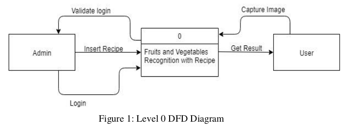 
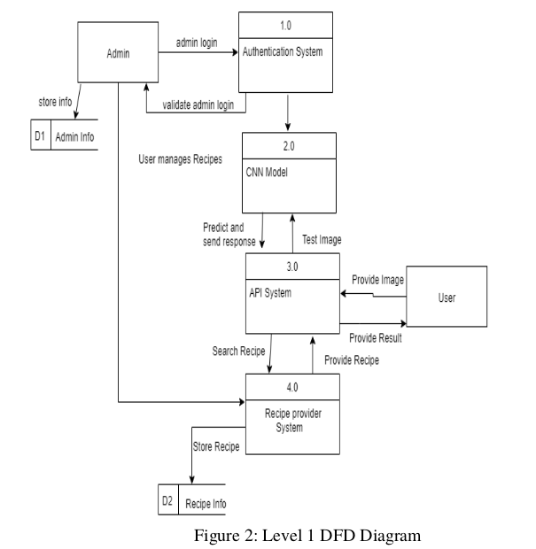
###ER Diagram 
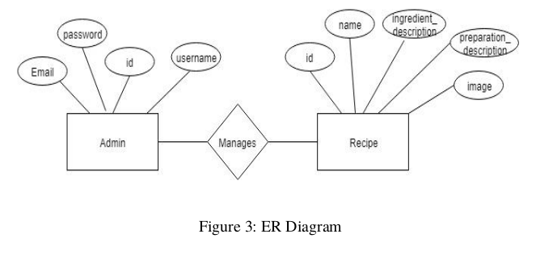
###Sequence Diagram 
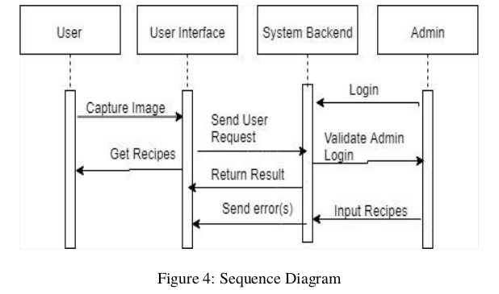
###Activity Diagram 
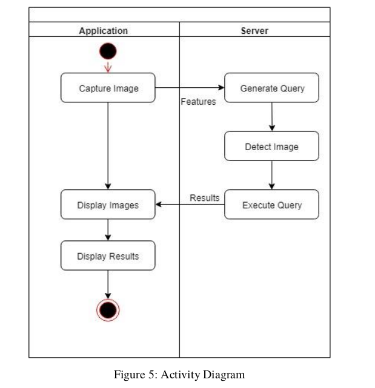
###Block Diagram 
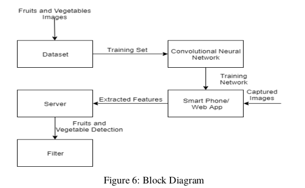
###System Architecture Diagram 
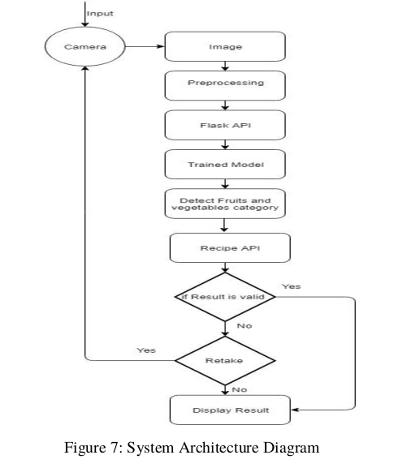
###Conceptual Diagram 
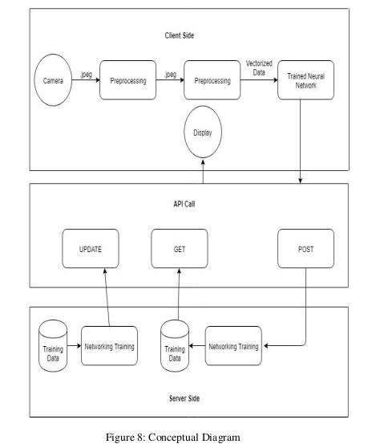
###Schema Diagram 
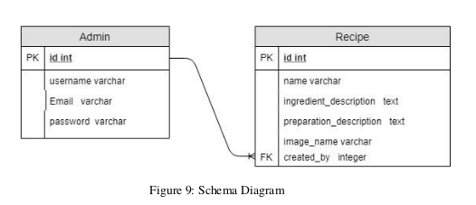
###Use Case Diagram 
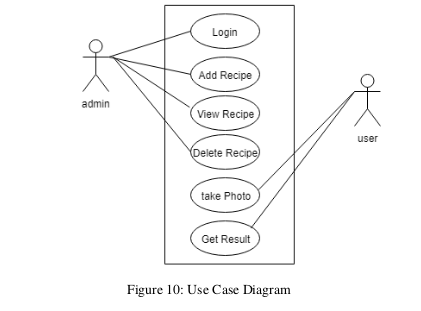

<h3>Final Result</h3>
 
<strong>On Console</strong>
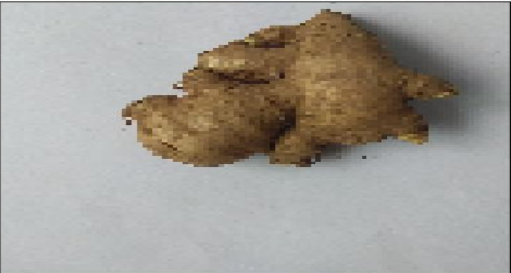
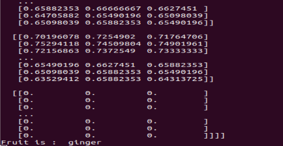
<strong>On Mobile Phone</strong>

The train accuracy was 99.14%, validation accuracy was 96.06% and the test accuracy was 98.79%. 

 
Vegetable Dataset that I created is available on kaggle. Link is given below. 
<strong><a href = https://www.kaggle.com/datasets/shubhampokhrel81/vegetables360-dataset>Vegetable Dataset</a></strong>
